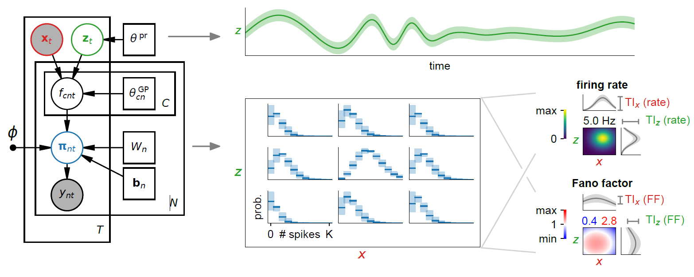

# A universal probabilistic spike count model reveals ongoing modulation of neural variability (NeurIPS 2021)


## Overview

This is the code repository for this [paper](https://www.biorxiv.org/content/10.1101/2021.06.27.450063v2).
Models are implemented in Python with dependencies on libraries listed below at the end.
We also include a neural data analysis library that was written for constructing scalable neural encoding models using a modern deep learning framework.
The baseline models, along with the universal count model proposed in our work, are implemented in the library and can be used for analysis of other neural datasets.

<p align="center">
 
</p>


## Reproducing the results in the paper


#### 1. cd into ./scripts/
Here is where all the code for fitting models, analysis and plotting is located.


#### 2. (Optional) Run the synthetic_data notebook to generate data from synthetic populations
This generates the two synthetic populations and saves them into ./data/, both generated spike counts and behaviour as well as the encoding models.
Note that the population data used in the paper has been included in ./data/, running this script will overwrite those files!


#### 3. Run the scripts to fit models

##### Command line format
Run commands based on the following formats into the command line:
```
python3 validation.py --cv -1 2 5 8 --gpu 0 --modes 0 --datatype 0 --ncvx 2 --lr 1e-2 --lr_2 1e-3 --batchsize 10000
```
This runs a model of mode 0 on synthetic data, with `--cv` indicating which cross-validation fold to leave out for validation (-1 indicates using all data) and `--gpu` indicating the GPU device to run on (if available).
Line 188 in validation.py gives the definition of all modes (numbered 0 to 8), in particular the likelihood (1st element of tuple) and the input space (2d element of tuple) are specified.
Note there is a 10-fold split of the data, hence the cv trial numbers can go from -1 to 9.
`lr` and `lr_2` indicate the learning rates, with `lr_2` for toroidal kernel lengthscales and variational standard deviations of the latent state posterior (lower for latent models as described in the paper).
The flag `--ncvx` refers to the number of runs to do (selecting the best fit model after completion to save).
One can also specify `--batchsize`, which can speed up training when larger depending on the memory capacity of the hardware used.
For validation.py, the flag `--datatype` can be 0 (heteroscedastic Conway-Maxwell-Poisson) or 1 (modulated Poisson).
```
python3 HDC.py --cv -1 1 3 6 --gpu 0 --modes 0 --ncvx 2 --lr 1e-2 --lr_2 1e-3 --binsize 40
```
Similarly, this runs a model of mode 0 on head direction cell data, with head direction cell data binned into 40 ms bins set by `--binsize`.
Line 108 in HDC.py gives the definition of all modes for the head direction cell models (numbered 0 to 11).
All possible flags and their default values can be seen in the validation.py and HDC.py scripts.
The file models.py defines the encoding models and uses the library code (neuroprob) to implement and run these probabilistic models.

In terms of neural data, the synthetic populatio data used in the paper and the head direction cell data is included in the ./data/ folder.
All required modes in the analysis notebooks can be seen in the code as it loads trained models.
Note that there are separate notebooks for synthetic (validation) and real (HDC) datasets.
All trained models are stored in the ./checkpoint/ folder.


##### Experiments in the paper
Synthetic data:
- regression models `python3 validation.py --cv -1 2 5 8 --gpu 0 --modes 0 1 2 3 --datatype 0 --ncvx 2 --lr 1e-2`
- latent variable models `python3 validation.py --cv -1 2 5 8 --gpu 0 --modes 4 5 6 7 --datatype 0 --ncvx 3 --lr 1e-2 --lr_2 1e-3`
- progressively capturing single neuron variability and noise correlations `python3 validation.py --cv -1 2 5 8 --gpu 0 --modes 0 2 8 --datatype 1 --ncvx 2 --lr 1e-2`

Head direction cell data:
- regression with different likelihoods `python3 HDC.py --cv -1 1 2 3 5 6 8 --gpu 0 --modes 0 1 4 --ncvx 2 --lr 1e-2 --binsize 40`
- regression with different regressors `python3 HDC.py --cv -1 1 2 3 5 6 8 --gpu 0 --modes 2 3 --ncvx 2 --lr 1e-2 --binsize 40`
- joint latent-observed models `python3 HDC.py --cv -1 1 2 3 5 6 8 --gpu 0 --modes 5 6 7 8 --ncvx 3 --lr 1e-2 --lr_2 1e-3 --binsize 40`
- latent variable models `python3 HDC.py --cv -1 1 2 3 5 6 8 --gpu 0 --modes 9 10 11 --ncvx 3 --lr 3e-2 --lr_2 5e-3 --binsize 100`

If you wish to run different modes or cross-validation runs grouped together above in parallel, run the command several times with only a single mode or cv trial each time.


#### 4. Run the analysis notebooks to analyze the data
By running the analysis notebooks, we reproduce the plotting data for figures in the paper.
Intermediate files (pickled) will be stored in the ./checkpoint/ folder.


#### 5. Run the plotting notebooks
This loads the analysis results and plots paper figures in .pdf and .svg formats, exported to the ./output/ folder.


## Neural data analysis library

Here we present a short description of a preliminary version of the neural data analysis library used (called neuroprob) to facilitate constructing neural encoding models.
The list below shows what has implemented for use so far, see the models.py file for an example of code utilizing the library.


#### Primitives

There are three kinds of objects that form the building blocks:
1. Input group *p(X,Z)* and *q(Z)*
2. Mapping *p(F|X,Z)*
3. Likelihood *p(Y|F)*

The overal generative model is specified along with the variational posterior through these primitives.
Input groups can contain observed and latent variables, with different priors one can put onto the latent variables.


#### Models implemented

* Linear-nonlinear and GP mappings
* RNNs
* LVMs
    - Toroidal latent space priors ([Manifold GPLVM](https://arxiv.org/abs/2006.07429))
    - AR(1) temporal prior on latents
* GLM filters
    - spike-history couplings
    - spike-spike couplings
    - stimulus history
* Inhomogenenous renewal point processes
    - Gamma
    - Inverse Gaussian
    - Log Normal
* Count process likelihoods
    - Poisson
    - Zero-inflated Poisson
    - Negative binomial
    - Conway-Maxwell-Poisson
    - Universal (this work)
* Gaussian likelihoods
    - Univariate


## Dependencies:
- [PyTorch](https://pytorch.org/) version >= 1.7
- [NumPy](https://numpy.org/)
- [SciPy](https://scipy.org/)
- [tqdm](https://tqdm.github.io/) for visualizing fitting/training progress
- [Daft](https://docs.daft-pgm.org/en/latest/) to plot graphical model components
